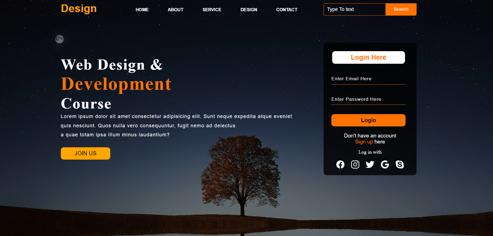

# Webpage Design README

This repository contains the code for a simple webpage design template.

## Contents

1. [Introduction](#introduction)
2. [Features](#features)
3. [Usage](#usage)
4. [Contributing](#contributing)
5. [License](#license)

## Introduction

This HTML template provides a basic structure for a webpage design. It includes a navigation bar, content section, and a login form.

## Features

- **Navigation Bar**: The template features a navigation bar with links to various sections of the website.
- **Content Section**: There is a main content section with a title, paragraph, and a button to join.
- **Login Form**: A login form is included with fields for email and password, along with login and sign-up links.
- **Social Media Icons**: Social media icons are provided for easy access to different platforms.

## Usage

To use this template, simply clone the repository or download the HTML file and associated CSS file. You can then modify the content, styles, and functionality as per your requirements.

### CSS Customization

The CSS provided includes styling for various elements of the webpage. You can customize the styles further by modifying the CSS properties. Here are some key CSS selectors and their properties that you can adjust:

### How it looks

